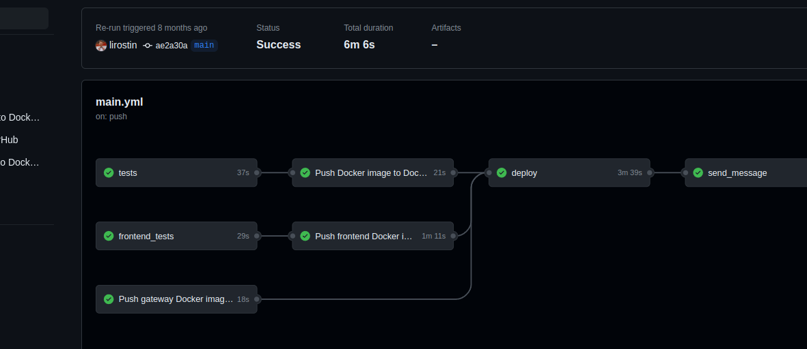

### Hi there 👋

Меня зовут Кирилл, я DevOps инженер.
Кроме изучения DevOps практик мне нравится заниматься программированием.
В открытых проектах можно ознакомится с моей реализацией [telegramm бота](https://github.com/lirostin/homework_bot) и [web приложением taski](https://github.com/lirostin/taski-docker) где реализован CICD на платформе githab. 

В качестве хобби люблю решать алгоритмические задачи.

<!--

 

 

-->
